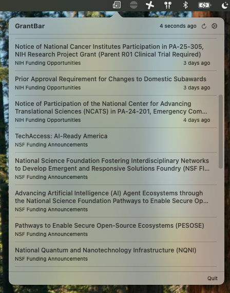

# GrantBar

A macOS menu bar app for tracking research funding announcements from NIH, NSF, and any other RSS feed. Click the icon to see the latest items; get a notification when something new comes in.



## Install

Download `GrantBar.dmg` from the [latest release](https://github.com/stephenturner/grantbar/releases/latest), open it, and drag GrantBar to Applications.

Because the app is not notarized with an Apple Developer certificate, macOS will block it on first launch. To open it anyway: right-click the app in Finder and choose Open, then click Open in the dialog. You only need to do this once.

## Usage

GrantBar lives in your menu bar. Click the newspaper icon to see recent announcements across all your feeds, sorted by date. Click any item to open it in your browser.

**Refreshing**: feeds refresh automatically every 30 minutes. Click the refresh button in the popover to fetch immediately.

**Notifications**: on first launch, GrantBar silently fetches all feeds to establish a baseline. After that, any new item that arrives triggers a notification. Clicking a single-item notification opens that item directly in your browser.

**Managing feeds**: click the gear icon in the popover to open the feed manager, where you can add feeds by URL, rename them, toggle them on/off, or remove them.

### Default feeds

GrantBar ships with two feeds pre-loaded:

| Feed | URL |
|------|-----|
| NIH Funding Opportunities | https://grants.nih.gov/grants/guide/newsfeed/fundingopps.xml |
| NSF Funding Announcements | https://www.nsf.gov/rss/rss_www_funding_pgm_annc_inf.xml |

Any RSS 2.0 or Atom feed URL works.

## Build from source

Requires macOS 13+ and the Xcode command line tools (`xcode-select --install`).

```bash
git clone https://github.com/stephenturner/grantbar.git
cd grantbar
bash build.sh
open GrantBar.app
```

To install to Applications:

```bash
cp -r GrantBar.app /Applications/
```

To build a distributable DMG:

```bash
bash package.sh 1.0.0
```

## License

GNU Affero General Public License v3.0.